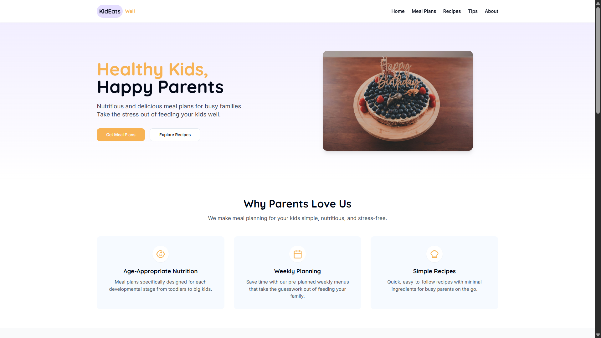
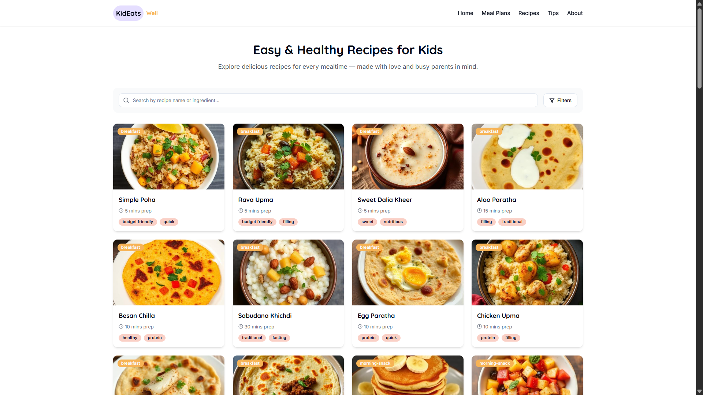
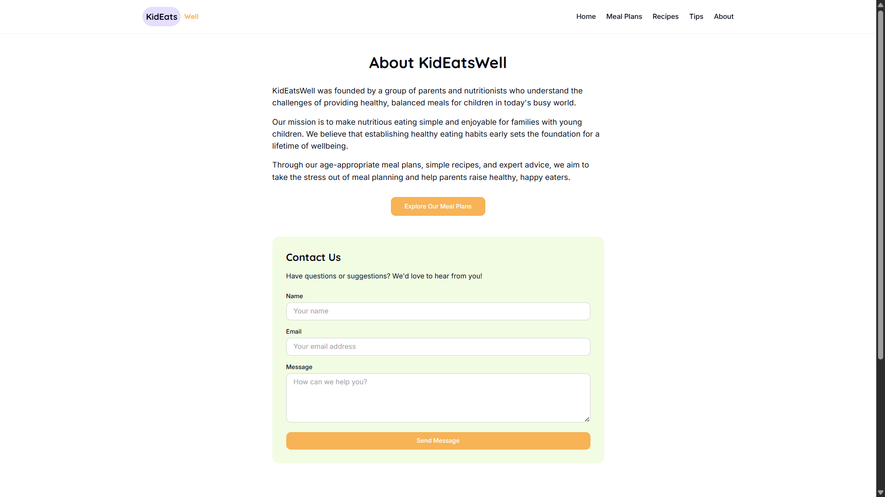

# Kid Eats Well 🍽️

**Kid Eats Well** is a web application designed to help parents discover healthy, nutritious, and kid-friendly meal ideas. The platform provides simple recipes, balanced meal suggestions, and useful tips to encourage healthy eating habits for children.

Live Demo: https://kid-eats-well-plans.vercel.app

## 🚀 Features

* 🥗 Healthy recipes for kids
* ⏱ Quick and easy meal preparation ideas
* 🍱 Meal plan suggestions
* 👨‍👩‍👧 Helpful nutrition tips for parents
* 📱 Responsive design for all devices

---

## 🛠 Tech Stack

* **React**
* **TypeScript**
* **Vite**
* **Tailwind CSS**
* **shadcn-ui**

---

## 📸 Screenshots

### Home Page



### Recipes Section



### Meal Plan Page


### About Page



---

## ⚙️ Installation

Clone the repository:

```bash
git clone https://github.com/Lokesh-up/kid-eats-well-plans.git
```

Navigate to the project folder:

```bash
cd kid-eats-well-plans
```

Install dependencies:

```bash
npm install
```

Run the development server:

```bash
npm run dev
```

Open your browser and visit:

```
http://localhost:8080
```

---

## 📁 Project Structure

```
src
 ├ components
 ├ pages
 ├ assets
 │   └ images
 ├ data
 └ styles
```

---

## 🔮 Future Improvements

* Recipe search functionality
* Meal plan generator
* Nutrition tracking
* User favorites and saved recipes

---

## 👨‍💻 Author

**Voruganti Lokesh**
B.Tech – Information Technology
VNR Vignana Jyothi Institute of Engineering and Technology
Graduation Year: 2027

---

⭐ If you like this project, feel free to give it a star!